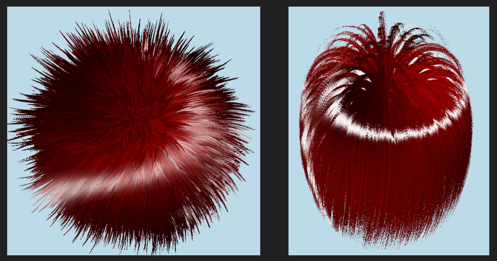

# OM3D
<a id="readme-top"></a>
# 3D Realistic Fur

<br />
<div align="center">
  <a href="https://github.com/Auxemite/om3D/">
     <!-- width="80" height="80"> -->
  </a>
</div>

<!-- ABOUT THE PROJECT -->
## About The Project

The objective of this project is to implement an optimized method for simulating realistic fur in 3D and in real time. To do this, we use shell rendering, an efficient, optimized, and widely used method that nevertheless has some known flaws. We have attempted to correct these flaws.

Simulating realistic fur in 3D is an optimization problem. Perfectly simulating the state of fur in real time is too computationally expensive. For this reason, several methods have been created to imitate realistic fur rendering, including shell rendering.

Shell rendering is a fur simulation method that involves creating shells around the relevant meshes on which to draw the state of the fur hairs. To simplify, we could say that shell rendering is similar to the idea of drawing a vertical hair on a sheet of paper with lots of small horizontal lines. The difference here is that the hair is drawn in 3D and the method aims to optimize computing time. Slides are available on the project for visual explanations.

### 3D engine optimization techniques

For this project, we implemented various solutions to optimize the 3D engine as a whole.

* Backface culling
* Frustum culling
* Z-Prepass
* G-Buffer
* Deferred shading (partially implemented)

### Fur Geometry
We have added real-time customization of shell rendering settings :
* Shell number
* Density (number of fur hair)
* Length
* Thickness

In addition to the parameters related to shell rendering, we attempted to apply internal and external constraints on the fur :
* Fuzziness
* Curlyness
* Gravity
* Wind
* Turbulence
* Rigidity

### Fur Lightling

For the lighting, we first tried using standard lighting management parameters:
* Ambient
* Fur deepness (the closer the part of a hair is to the base, the darker it is)
* Labertian diffuse BRDF
* Cook-Torrance GGX specular BRDF

The result was unsatisfactory and stemmed from the very principle of shell rendering. Fur hairs are not physically hairs (rather, they are a disc pattern drawn on the mesh shells) and, as a result, the light calculations related to the surface normal in particular are incorrect.

We therefore used the Kajiya-Kay method (based on the Blinn-Phong model), which allows us to simulate the physical information of the hairs in real time in order to recover the surface normal and thus calculate the light on each surface.

### Shell rendering corrections

The major problem with shell rendering is visible when the hairs are on the edges of the mesh: the different shells can be seen. To correct this problem, we implemented a method called "fins".

<p align="right">(<a href="#readme-top">back to top</a>)</p>

### Built With

The project is in CPP and the interface has been developped with IMGUI/OPGL/GLFW.
* [![Cpp][Cpp.cpp]][Cpp-url]
* [![OpenGL][OP.GL]][OPGL-url]
* [![ImGUI][IM.GUI]][IMGUI-url]
* [![GLFW][GL.FW]][GLFW-url]

## Getting Started

This project has been developped on Windows10 and Linux and should work on both. (Not tested on MacOs)

### Prerequisites

`cmake 3.20` minimum, `C++17`, and `Opengl 4.5`

### Installation

1. Clone the repo
```sh
git clone https://github.com/Auxemite/om3D
```

2. Build
```sh
mkdir -p build/debug
cd build/debug
cmake ../..
make -j
```

3. Run
``` sh
./om3D
```

## Sources

Shell Rendering : https://www.youtube.com/watch?v=9dr-tRQzij4 
		   https://hhoppe.com/fur.pdf 

Kajiya Kay:  https://jacob-lopez.github.io/SairHimulator/report.html 
	  https://dl.acm.org/doi/pdf/10.1145/74334.74361 
  https://www.programmersought.com/article/69504579106/ 

Geometry :   https://youtu.be/aEpklsGKVmQ?t=1028 
https://web.media.mit.edu/~bandy/fur/CGI10fur.pdf

Instancing :   https://learnopengl.com/Advanced-OpenGL/Instancing
	          https://youtu.be/yy2Zq-WkNqI?si=BzX4JzA8_E2nVJDt

Fins:   https://github.com/hecomi/UnityFurURP?tab=readme-ov-file
            https://hhoppe.com/fur.pdf 

<!-- AUTHORS -->
## Authors
Alexandre Lamure
Gregoire Angerand
Ernest Bardon
Kael Facon

<!-- MARKDOWN LINKS & IMAGES -->
<!--5586a6-->
[OP.GL]: https://img.shields.io/badge/opengl-FFFFFF?logo=opengl&style=for-the-badge
[OPGL-url]: https://opengl.org/

[Cpp.cpp]: https://img.shields.io/badge/c++-00599C?logo=c%2B%2B&style=for-the-badge
[Cpp-url]: https://www.cppreference.com/

[IM.GUI]: https://img.shields.io/badge/IMGUI-151617?logo=imgui&style=for-the-badge&logoColor=white
[IMGUI-url]: https://github.com/ocornut/imgui

[GL.FW]: https://img.shields.io/badge/GLFW-ff9a29?logo=glfw&style=for-the-badge
[GLFW-url]: https://glfw.org/
